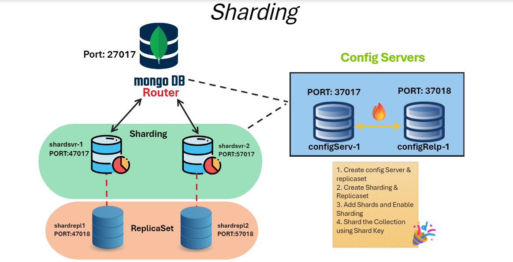

## Starting Instances 

*Figure For Reference*



1. Config Server & ReplicaSet
```javascript
mongod --configsvr  --port 37017 --replSet configReplSet --dbpath "C:\MongoDB_Sharding\cfg"
```

```javascript
mongod --configsvr  --port 37018 --replSet configReplSet --dbpath "C:\MongoDB_Sharding\cfg_repl"
```


2. Shard 1 & ReplicaSet
```javascript
mongod --shardsvr --port 47017 --replSet shard1 --dbpath "C:\MongoDB_Sharding\shd1"
```

```javascript
mongod --shardsvr --port 47018 --replSet shard1 --dbpath "C:\MongoDB_Sharding\shd1_repl"
```


3. Shard 2 & ReplicaSet
```javascript
mongod --shardsvr --port 57017 --replSet shard2 --dbpath "C:\MongoDB_Sharding\shd2"
```

```javascript
mongod --shardsvr --port 57018 --replSet shard2 --dbpath "C:\MongoDB_Sharding\shd2_repl"
```


## Configure ReplicaSet for Each Instances

1. Configure ReplicaSet for ConfigDB
```javascript
mongosh --port 37017
```

```javascript
rs.initiate({_id:"configReplSet",members:[{_id:0,host:"localhost:37017"},{_id:1,host:"localhost:37018"}]})
```


2. Configure ReplicaSet for Shard1
```javascript
mongosh --port 47017
```

```javascript
rs.initiate({_id:"shard1",members:[{_id:0,host:"localhost:47017"},{_id:1,host:"localhost:47018"}]})
```


3. Configure ReplicaSet for Shard2
```javascript
mongosh --port 57017
```

```javascript
rs.initiate({_id:"shard2",members:[{_id:0,host:"localhost:57017"},{_id:1,host:"localhost:57018"}]})
```


## Starting Mongos (i.e Router Server)
```
mongos --configdb configReplSet/localhost:37017,localhost:37018 --port 27017
```


## Sharding Database
### Connect to Mongos Shell 
```javascript
mongosh --port 27017
```

### Adding Shards
```javascript
sh.addShard("shard1/localhost:47017,localhost:47018")
```

```javascript
sh.addShard("shard2/localhost:57017,localhost:57018")
```
### Enabling Sharding For a Database
*Prerequisite :* Create Database name `demo` and collection name `zip` & import dataset using `csv` file.
- Dataset Nanem: `Pincodes-India.csv` [Click to Download Dataset](https://github.com/AsadCodeCraft/MongoDB/blob/main/pincode-dataset.csv)
```javascript
sh.enableSharding(demo)
```

### Verifying & Checking Shard Status
```javascript
sh.status()
```

### Create Index of Collection 
```javascript      
db.zip.createIndex({Pincode : 1})
```
### Sharding (Ranged Based) Collection using Shard Key 
```javascript
sh.shardCollection("demo.zip", { Pincode : 1} )
```
 
### Checking Shard Data Distribution
```javascript
db.zip.getShardDistribution()
```

### Manually Splitting Chunks
```javascript
sh.splitAt("demo.zip", { Pincode : 200000})
sh.splitAt("demo.zip", { Pincode : 400000})
sh.splitAt("demo.zip", { Pincode : 600000})
```
### Move Chunk Manually From One Shard to Other
```javascript
sh.splitAt("demo.zip", { Pincode : 400000}, "shard1")
```
